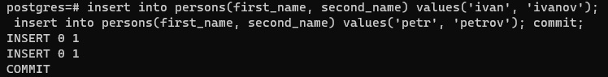

# Домашнее задание №1

Описание/Пошаговая инструкция выполнения домашнего задания:

* создать новый проект в Google Cloud Platform, Яндекс облако или на любых ВМ, докере
* далее создать инстанс виртуальной машины с дефолтными параметрами
  > результат: 

* добавить свой ssh ключ в metadata ВМ
* зайти удаленным ssh (первая сессия), не забывайте про ssh-add
* поставить PostgreSQL
  > результат: 
* зайти вторым ssh (вторая сессия)
* запустить везде psql из под пользователя postgres
* выключить auto commit
  > результат:                                   
* сделать в первой сессии новую таблицу и наполнить ее данными
  * create table persons(id serial, first_name text, second_name text);
  * insert into persons(first_name, second_name) values('ivan', 'ivanov'); 
  * insert into persons(first_name, second_name) values('petr', 'petrov'); 
  * commit;
  > результат:   
* посмотреть текущий уровень изоляции
  * show transaction isolation level;
  > результат:   
* начать новую транзакцию в обоих сессиях с дефолтным (не меняя) уровнем изоляции
* в первой сессии добавить новую запись insert into persons(first_name, second_name) values('sergey', 'sergeev');
* сделать select * from persons во второй сессии
* видите ли вы новую запись и если да то почему?
**_Новой записи нет._** 
* завершить первую транзакцию - commit;
* сделать select * from persons во второй сессии 
* видите ли вы новую запись и если да то почему?
**_Да, появилась новая запись. Неповторяющееся чтение при уровне изоляции Read Committed._**
* завершите транзакцию во второй сессии
* начать новые но уже repeatable read транзации - set transaction isolation level repeatable read;
* в первой сессии добавить новую запись insert into persons(first_name, second_name) values('sveta', 'svetova');
* сделать select * from persons во второй сессии
* видите ли вы новую запись и если да то почему?
**_Новой записи нет._**
* завершить первую транзакцию - commit;
* сделать select * from persons во второй сессии
* видите ли вы новую запись и если да то почему? 
**_Новой записи нет. В Postgres фантомного чтения у Repeatable Read не допускается._**
* завершить вторую транзакцию
* сделать select * from persons во второй сессии 
* видите ли вы новую запись и если да то почему? 
**_Да. Потому что прошлая транзакция завершена, а это уже в новой транзакции._**

